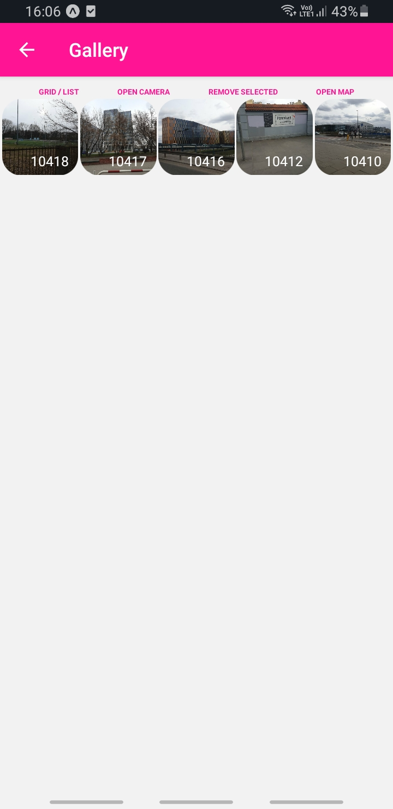
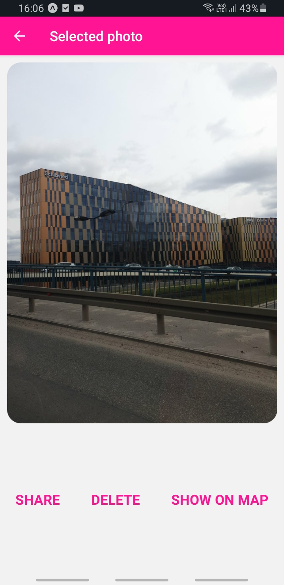
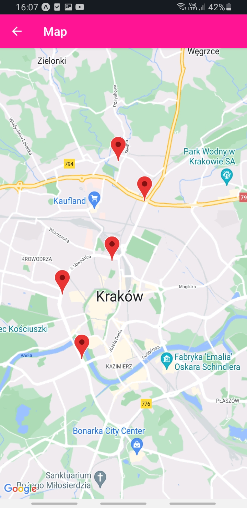

# Photos Locations
Mobile app made using React Native that allows user to take photos and save locations of where they were taken. Photos can be later viewed in a gallery and shared. There is also a screen with a map that shows all locations of taken photos and lets user go to them easily.

